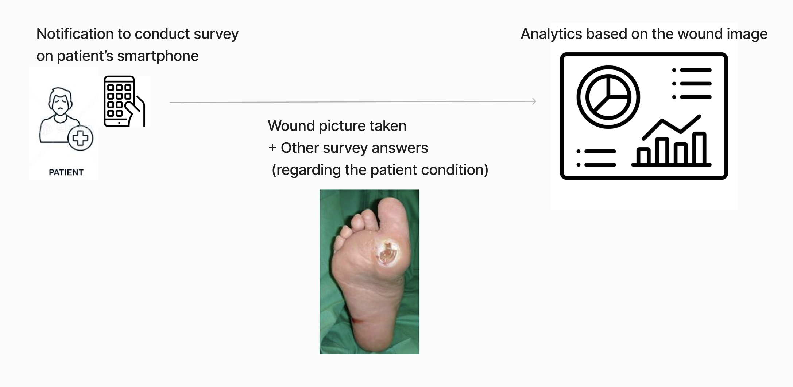

# Diabetic Foot Ulcer (DFU)

## Overview

- Diabetic Foot Ulcer (DFU) is a common and serious complication of diabetes that results from poor blood circulation and nerve damage (neuropathy), leading to slow-healing wounds on the feet. 
- One of the reason for the arising of DFU especially in some countries are due to eating habits with high-sugar content. This leading to uncontrolled blood sugar levels. 
- Once injuries to the foot occured, it might lead to severe infections and, in extreme cases, amputation if left untreated.

## Proposed Strategy to Take Care of DFU Patient

- With the complexity of foot wound care, survey on smartphone app is conducted where foot wound pictures is taken by patient/caregiver. 
- Picture of foot wound are taken on survey conducted on regular basis to 
    - inspect foot condition
    - recommendation on care (including advise to visit facility care if wound get worsen)

## Take Home Assignment

### Model Building
-  Dataset are provided in the release, perform the following task with the given dataset
    - Provided preliminary statistics/data analysis towards the dataset
    - Use ML/DL Framework to build two classification models that does
        - Classification of Healthy Skin and Ulcer
        - Classification of Foot Wound and Other Wound
- Welcome to use the tools/libraries/framework that you are familiarize with. 
- No particular restrictions on the programming language / technical approaches. 
- Present the materials needed to reproduce the results.

### Technical Documentation

- Given the understanding of the proposed strategy above and the analysis towards the current dataset, give your suggestions/approach **as a data scientist** on categories below. 
    - Data collection
        - How should the data collection be improved given the analytics of current dataset?
        - How to collect good quality dataset? What actual steps should be taken to achieve that? 
        - Factoring in wound size, wound shape, distance/angle to camera, how would data scientist advise the data collection procedure to be?
    - Data annotation
        - What type of labels should be provided by doctors?
            - Which type of label tags is needed?
            - What type of labelling techniques should be incorporated to further help the patient care? (Bounding Box, Segmentation, etc)
    - Model Building
        - How many stages/How many models does a data scientist recommend as a whole solution?
    - Validation
        - How to make sure that an AI model build is useful for real life use case?  
- __Note__: 
    - Elaboration to the items above are very much valued. 
    - Other aspects which are not written above are welcome to be included. 
    - Fact-based justifications including the reference to papers/technical write ups is welcomed.
    - Please note that this is an open ended question and the ability to provide valuable insights into how to build a robust and complete Diabetic Foot Wound solution is of significant importance

## How to Submit Take Home Assignment

- Clone this repository.
- Submission with addition of material to this repository in a zip format.
- Preference on writing in English to demonstrate the ability to work with cross-functional team.  

## Evaluation of the Take Home Assignment

- Evaluation of the take home assignment is layout as below
    - The analytics towards current dataset and breakdown of the dataset into usable statistics 
    - The model building with ML/DL Framework and elaboration of the evaluation metrics 
    - The use of tool/library/framework in the scope of Data Science
    - The familiarization of code sharing ecosystem (github/gitlab, pull request, git commands, etc)
    - The use of documentation/structure to present technical work
        - The details and component needed (requirements.txt, testing script, ...) to reproduce the results 
        - The use of Markdown
        - The readability of the code
    - The ability to breakdown an AI use case to create real value from the pain point