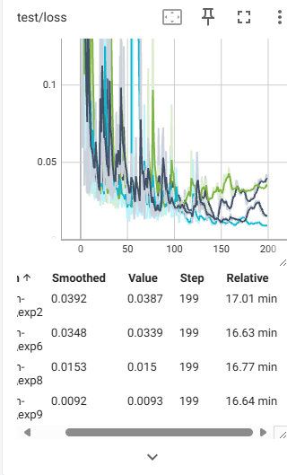
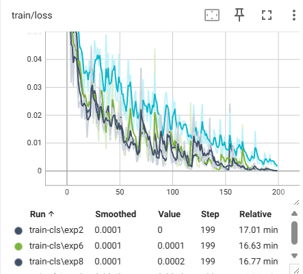
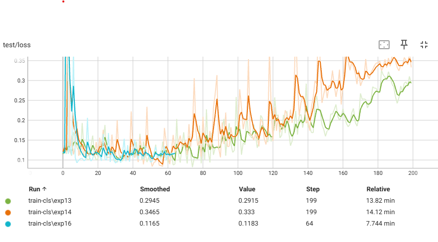
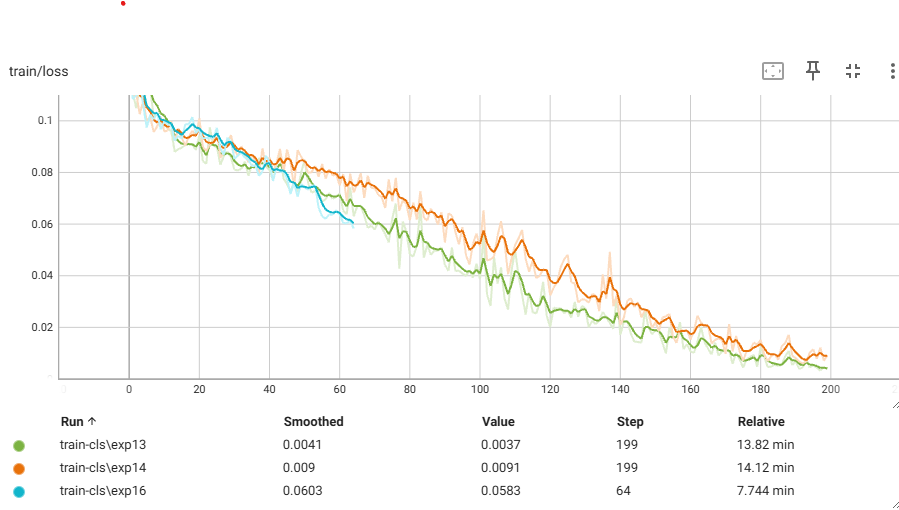

## Environment:

python >= 3.9

```bash
$ cd DFU-GELAN
$ pip install -r requirements.txt
$ export PYTHONPATH=.
```


## Move download data to current location
```bash
$ export path_to_data_skin=path to foot-wound-other-wound-split
$ export path_to_data_other=path to foot-wound-other-wound-other
$ mv $path_to_data_skin . 
$ mv $path_to_data_skin .
```
Download [gelan](https://github.com/WongKinYiu/yolov9/releases/download/v0.1/gelan-c.pt) and move it to yolov9/weights


## Provided preliminary statistics/data analysis towards the dataset
1. Image size analysis

```bash
$cd code
```

See "code\pre-analysis.ipynb"


## Classification

The winner of DFU classfication task use HardNet which follows the densenet structure. However, this structure was found inefficient gradient use which degrades the model. I utilize backbone of YOLOV9, GELAN which has abundant and efficient gradient flow.

#### 1. Classification of Healthy Skin and Ulcer

You can retrain 

```bash
# Split train test
$ python3 preprocess.py
# training a classification model
$ python3 train_skin.py --cat skin
```

Or download model [here](https://github.com/ansonuser/DFU-GELAN/releases/download/v1.0/skin_augment_final.pt)

```bash
# generate test prediction
$ python3 inference_skin.py --weights $path_to_weights
# post-analysis of the model performance fail on which images
$ python3 post-analysis.py
```



Improve by:
- Flip, hue augmentation
- Regularization with dropout
- Reduce embedding dimension in the head
- Increase weight decay

Testing result:
- Accuracy: 98.5%
- Recall: 98%

#### 2. Classification of Foot Wound and Other Wound
NN-Based model only use small size (resize to 224x380)
- Data Issue
    - Validate with both NN-based method and simple logit regression:
        - Simple logit regression got test accuracy around 85%-92% (depends on seed)
        - GELAN + classified head shows test loss increases while train loss decreasing even with strong regularization. (Augmentation makes it worse)

Training models:
1. Logit Regression

```bash
$ python classification2
```

2. GELAN 

```bash
$ python3 train_skin.py --cat other
```

or download [here](https://github.com/ansonuser/DFU-GELAN/releases/download/v1.0/other_augment_final.pt)





Observe your training:

```bash
$ tensorboard --logdir=runs --port=6006
```

Observe your tuning:
```bash
$ mlflow server --host 127.0.0.1 --port 8888
```

--- 

## Data Collection: How to Improve It

### 1. **Consistency in Wound Size Representation**

* Use **physical rulers** or **printed scale markers** in every frame to normalize size across images.
* Incorporate a **known reference object** to correct for pixel-to-mm scale at inference time.

### 2. **Well-Defined Imaging Rules**

* Design a **data acquisition protocol** with the following:

  * Fixed **Field of View (FoV)** and distance (e.g., 30 cm).
  * 90° top-down angle with full wound and surrounding tissue visible.
  * Avoid glare/shadows by using diffuse lighting or flash diffusers.

> *FoV isn’t the primary issue — rather, consistent framing of the wound and relevant skin/tissue context is vital for analysis.*

### 3. **Focus on Clinical Relevance**

* Capture what matters for **clinical decisions**:

  * Tissue types (slough, granulation).
  * Color changes, edges, necrotic zones.
  * Progression over time.

> *You’re not just collecting images — you’re collecting **evidence for clinical judgment***

---

## Data Annotation Strategy

### 1. **Evolving Task Types**

* DFU annotation has progressed from:

  *  *Image-level classification*
  *  *Instance segmentation* (e.g., wound boundary)
  *  *Unsupervised semantic segmentation* (tissue-level analysis)

> *This evolution allows more granular monitoring and better modeling of healing trajectory.*

---

### 2. **Task-Dependent Labeling Needs**

| Task             | Label Type                                                 | Purpose                                                              |
| ---------------- | ---------------------------------------------------------- | -------------------------------------------------------------------- |
| Wound Monitoring | **Segmentation**                                           | Measure wound area, track healing, tissue types                      |
| Early Detection  | **Binary labels** (healing vs non-healing) + **meta info** | Use images with structured data (e.g., HbA1c, age) for risk modeling |

* Integrate **structured EHR data** (e.g., temperature, infection markers) for more powerful multimodal analysis.

---

### 3. **Suggested Techniques & Architectures**

* **Image + Measurement fusion**:

  * Use **vision-language models** like **CLIP**, or **transformers (e.g., Swin)** to jointly model visual and structured inputs.

* **Segmentation Tasks**:

  * Apply **U-Net**, **DeepLabV3+**, or **Swin-UNet** for precise wound boundary or tissue-type segmentation.

* **Unsupervised**: Consider **autoencoder-style** or **contrastive learning** methods to cluster wound types or detect anomalies without full labels.

---

### 4. **Evaluation & Clinical Integration**

* Conduct **A/B testing**:

  * Compare outcomes between **high-risk predictions** and **low-risk groups**.
  * Track healing rates, infection incidence, or treatment changes.

* Measure **clinical utility**:

  * Reduction in time to intervention.
  * Consistency with physician risk assessment.


## Referene
- Wang X, et al, Diabetic foot ulcer, World J Diabetes 2022; 13(12): 1049-1065 
- TY Liao et al, HarDNet-DFUS, CVPR, 2022
- CY Wang et al, YOLOv9: Learning What You Want to Learn Using Programmable Gradient Information, CVPR, 2024
- CY Wang et al, CSPNet:  A New Backbone that can Enhance Learning Capability of CNN, CVPR, 2019


